

 

    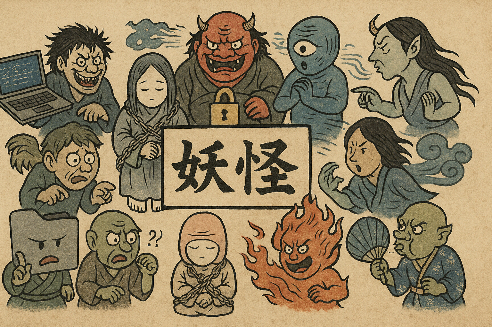
 

  [<a href="README.md">English</a>] | [<b>日本語</b>]

# 妖怪とは?

日本人なら妖怪を説明する必要はありませんよね〜。  
ご存じのとおり、妖怪にはさまざまな種類があります。  
不思議な力を持ついたずら好きな動物、人を惑わす悪意ある怪物、
そして目に見えぬまま現実世界で不可思議な現象を起こすもの。  

このIT妖怪集では、最後の種類:「**見えぬ妖（あやかし）**」に焦点を当てています。  

あなたのコンピュータや機器で、時おり奇妙なことが起こるのを不思議に思ったことはありませんか？  
それは、プログラムに“バグ”(虫)が入り込んだせいではありません。  
もしかすると、あなたの知らぬうちに**見えぬ妖怪たち**が、そっと悪戯しているのかもしれませんよ。

# IT妖怪の研究

日々のテクノロジーを使用する中で数々の不可解な現象を経験し、妖怪の存在について知るうちに、
これらの現象のいくつかは、実は妖怪によって引き起こされているのではないかと疑念を抱くようになりました。  

この仮説を確認するため、過去十年間にわたり現場での調査研究を続けてまいりました。
調査には、神職の方々により祓い清めていただいた念動力測定器（Psychokinetic Energy Meter）や
霊質流束感知器（Ectoplasmic Flux Sensor）改良型を用い、  現代の機器を使用しながら、**目に見えぬ妖怪の存在**を
観測・記録いたしました。  

そして近年の技術的進歩により、自宅の研究室にて、量子もつれ妖怪再構成装置
（Quantum-Entangled Yōkai Reconstruction：Q-EYR）および霊質パターン認識モデル
（Ectoplasmic Pattern Recognition Model：EPR-2）を搭載したAIを用いて、収集データを解析した結果、
ついに、私たち人間の現代生活を悩ませてまいりました超常的な妖怪たちの正体を特定することに成功いたしました。  

本研究の成果を広く公開させていただくことで、皆様がIT環境における不可解な現象の原因を理解され、
それらの妖怪に対して適切な対策を講じられる一助となれば幸いに存じます。

# IT妖怪集

## 名食い（なぐい）— The Name Eater

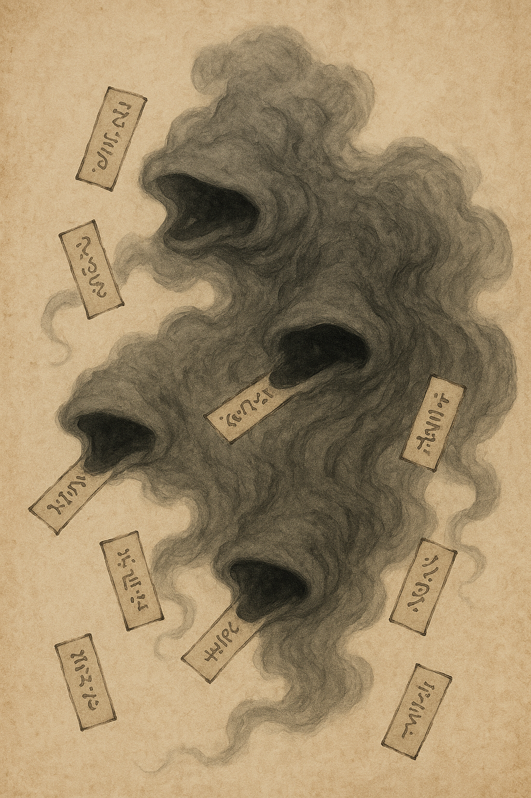

古い記録や言葉の裏には、名を喰らう妖が潜んでいるという。
その名を「名食い（なぐい）」と呼ぶ。

名食いは、人の知らぬ情報の路（みち）をさまよい、
呼び名や記録をひとつずつ盗み取っては、記憶の帳を白くしてゆく。
サーバは名を呼べず、住所(アドレス)は霧のなかへと消える。
やがて世界は「名のない道」と化し、呼び声も届かぬ。

その姿は霞（かすみ）のような霧で、無数の口がささやきを放つという。
ときおりケーブルの奥から、こんな声が聞こえることがある――

「名が見つからぬ……　名など存在せぬ……」

名食いは、遠い主機（しゅき）や忘れられた領域を呼び出そうとする者を好む。
古い記録や閉ざされた領域を喰らい、道を曖昧にし、
旅人を「未解決の空白」へと迷わせるのだ。

### 封じの法
* 八度唱える「解決（リゾルブ）の呪」を行うべし。
* 清き水をもって路を祓え（DNSキャッシュの清掃を行う）。
* 真の名を聖なる帳（hostsの記録）に記すべし。

### 古詠 名食いの句

名の道を　喰らひて笑ふ　霧の声
（名の通う道を喰らい、霧の声となって笑うもの。） 

---

## 論煽鬼（ろんせんき）- The Debate-Stirring Demon

人の言葉が行き交う場所には、必ずや「論煽鬼（ろんせんき）」という妖が潜んでいるという。
その姿は目には見えず、言の波を渡って心の中に忍び込む。

誰かの意見に反発を覚えたその瞬間、耳元でこう囁くのだ。  

> 「あの者は誤っている！正さねばならぬ！」

この声を聞いた者は、知らぬうちに筆（キーボード）を取り、言葉を投げ返す。
だが、言は言を呼び、火は火を生み、やがて理は崩れ、怒りだけが残る。
討論が尽きたとき、そこに立っているのは論煽鬼だけ。
燃え残った言の灰の上で、にやりと笑っているのだ。

### 性質
* 人の「正しくありたい」という心を糧とする。  
* 善悪の区別なく、両者に取り憑く。  
* SNSや掲示板、コメント欄など、言葉の集まる場を好む。  
* 正義を装い、争いを煽り立てる。  

### 封じの法
* 反論したくなったときは、まず深く息を吸い、三つ数えること。  
* 心の中で唱えよ——「世界を直すのは、我が務めにあらず」。  
* 窓(ウィンドウ)を閉じ、茶を啜り、外の風にあたるべし。  
* 鬼は注目を糧とする。沈黙こそ、最も強き封じ手なり。

### 古詠　論煽鬼の句

言の海　正す指あり　鬼ぞ笑ふ  
（言の海にて、正そうと指す手のうちに鬼は笑うもの。）

---

## 更新魔（こうしんま）— The Update Demon

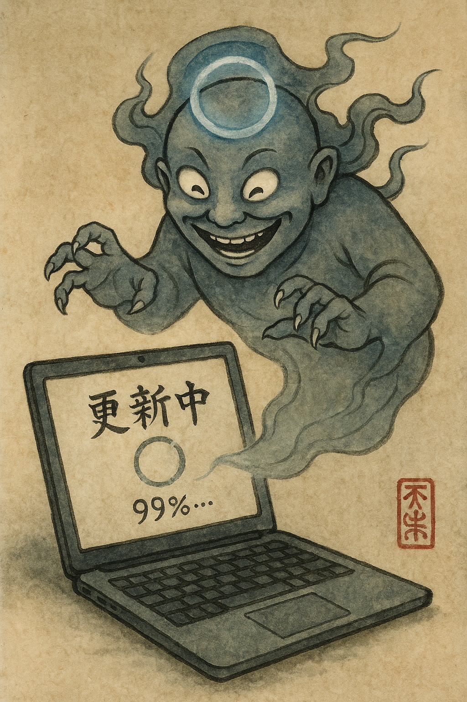

古き算箱（さんばこ）の界には、礼儀正しくして残酷なる妖が棲むという。
その名を「更新魔（こうしんま）」と呼ぶ。  

この鬼は、人が最も忙しい時を見計らって姿を現す。
発表の直前、会議の刻限、締切迫る夜などに、
穏やかな声でこう告げるのだ。

> 「更新の準備が整いました。今すぐ再起動してください。」

いったん目を覚ました更新魔は、いかなる願いも聞き入れない。  
進捗の棒は九十九で止まり、
時は凍り、労の音は静寂に沈む。
気づけば、青き輪が虚空にまわり、ただ鬼の笑い声が残る。

### 性質  

* 忙しく、あるいは心乱るる刻に現る。  
* 強制再起動や長き更新による苛立ちを糧とす。  
* 礼を装い、通知の文にて害を隠す。  
* 無限の輪、停止、そして「電源を切らないでください」を好む。  
* とりわけWindowsの箱（マシン）を好んで荒らす。  

### 封じの法  

* あらかじめ自らの刻を選び、静かなる更新を捧ぐべし。  
* 大事の前には更新を止め、鬼の目を逸らせ。  
* 再起の猶予を設け、業務の記録を必ず残すこと。  
* 怒りてはならぬ――苛立ちは鬼の糧となる。  

### 古詠　更新魔の句  

急ぐ夜　青き輪まわる　声は笑ふ  
（忙しき夜　青き輪めぐり　声ひそやかに笑ふ）

---

## 忘鍵鬼（ぼうけんき）— The Forgotten Key Demon

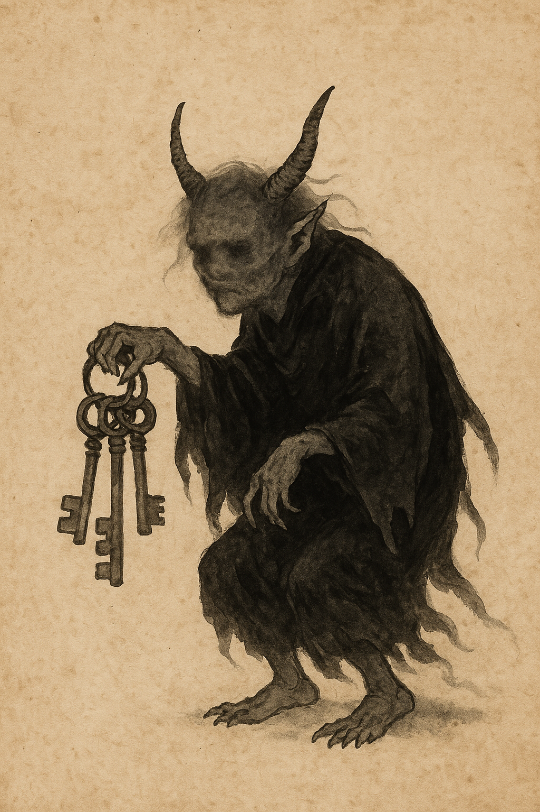

古き記録の界には、鍵を忘れし者の傍らに潜む妖あり。
その名を「忘鍵鬼（ぼうけんき）」と呼ぶ。  

この鬼は、言葉の呪（まじない）と記憶の紐（ひも）を喰らって生きる。
昼夜を問わず、書斎にも寝間にも忍び込み、
人の心より「思い出す力」を少しずつ啜ってゆく。  

その手に下げられた無数の鍵は、いずれも錠を失ったもの。
鬼はそれを鳴らしては笑い、
忘却に怯える人の姿を見て楽しむという。  

> 「正しき鍵は、いずこにありや……？」

人は焦り、何度も打ち込み、
「パスワードが誤っています」と告げられるたびに、
鬼の腹は満ちてゆくのだ。  

### 性質  

* 記憶の端から呪（パスワード）を喰らい、力を得る。  
* 忘却と怠慢を好み、久しく使われぬ鍵を棲家とす。  
* 安心に慣れた者の隙を見て忍び寄る。  

### 封じの法  

* 鍵を一つにまとめ、「主鍵（マスターキー）」として護るべし。  
* 記録の巻物（パスワード帳）は、暗号の符にて封ずべし。  
* 月ごとに古き鍵を改め、新たな力を与えること。  
* いかなる時も慌てず、「再生の儀（リセット）」を執り行うべし。  

### 古詠　忘鍵鬼の句  

鍵忘れ　思ひ出すまじ　鬼の舌  
（忘れし鍵　思い出すことなく　鬼の舌なめらかに光る）

---

## 焔評鬼（えんぴょうき）— The Reputation Scorching Demon

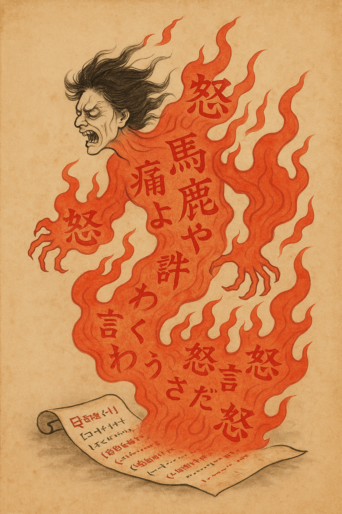

古き言葉や記録の奥には、眠れる焔（ほのお）の妖あり。
その名を「焔評鬼（えんぴょうき）」と呼ぶ。  

この鬼は、長く忘れられた言葉に潜み、
世の怒りが乾いた風となって吹き荒れるとき、目を覚ます。
誰かの古き呟き、戯れの言、軽き冗談――
それらに火を点け、瞬く間に炎と化すのだ。  

焔評鬼は誤解と憤りを糧とし、
群衆の視線と熱を集めて勢いを増す。
やがて一つの火種が大焔（たいえん）となり、
人々はその熱を楽しみながらも、己の指を焦がす。  

> 「正義の灯に見えて、我が焔こそ人の影を焼く。」

### 性質  

* 古き記録や言葉、忘れられた投稿に宿る。  
* 誤解・怒り・注目を糧として燃え広がる。  
* ひとたび目覚めれば、群衆の声を呼び、炎をあおぐ。  
* 無垢なる者ほど、明るく燃える。  

### 封じの法  

* 書かれたことを受け入れ、己を責めぬこと。  
* 火に風を送るなかれ――沈黙は焔を鎮める。  
* 炎が収まるまで、言葉を慎み、静かに待つべし。  
* 心の中で唱えよ:「意は善なり、火よ鎮まれ」と。  

### 古詠　焔評鬼の句  

言の灰　大焔となり　人ぞ寄る  
（言の灰より焔立ち、人はその熱に群がるもの。）

---

## 記憶蝕鬼（きおくしょっき）— The Memory-Eroding Fiend

算箱（さんばこ）の奥深く、記憶を喰らう小鬼が棲むという。
その名を「記憶蝕鬼（きおくしょっき）」と呼ぶ。  

この妖は、秩序ゆるみ、境界あやふき処に姿を現す。
手足は裂けた符号（コード）でできており、
その爪が触れるたび、整った記憶は乱れ、
清き数値は狂い、文は意味を失ってゆく。  

やがて計算の理は崩れ、言葉は壊れ、
箱の中は静かなる混沌に沈むのだ。  

> 「我は忘却の子、秩序を食らい、無音の崩れをもたらす。」

### 性質  

* 縁（ふち）なき場所――配列の外、忘れられた領域を好む。  
* 検証なき数、確かめぬ長さ、怠りし確認を餌とする。  
* 現れし跡には、奇妙な崩壊、壊れた文、狂う数が残る。  

### 封じの法  

* 境を守れ――長さと範囲を量り、入力を疑うべし。  
* 記憶の護符（スタックガード）を置き、堅牢なる術を用いること。  
* 算箱の守り（ASLR・DEP・CFIなど）を欠かすな。  
* 安き言語よりも、安全なる術を選べ。  
* 検証と試験を怠るな――それが最も古き護りの儀なり。  
* 急ぐ者ほど、この鬼の餌となる。慎みと手順こそが鎮魂の鍵なり。  

### 古詠　記憶蝕鬼の句  

記憶の層　爪に裂かれて　無音崩壊  
（幾重の記憶　爪に裂かれ　音もなく崩れゆく）

---

## 化字魍（けじもう）- The Distortion Spirit of Broken Text

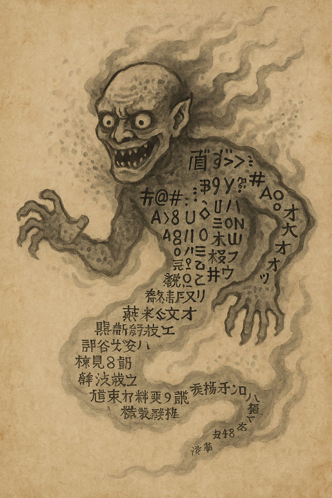

言葉と文字の狭間には、形を失いし魍（もう）なる妖あり。
その名を「化字魍（けじもう）」と呼ぶ。  

この鬼は、異なる文字と文字、言語と言語の境に生まれる。
古き書と新しき符号（コード）が出会う時、
その隙間に忍び込み、文の魂を喰らうのだ。  

正しき詩は歪み、語は化け、
気づけば画面に現れるは、意味なき呪文――  

> 「縺ゅ＞縺�∴縺�　□□□　譁�ｭ怜喧……」

化字魍は混乱と不調和を悦びとし、
記録を狂わせ、人を惑わせる。
特に西と東の書が交わる時、
この妖は最も楽しげに舞うという。  

### 性質  

* 異なる言語・文字・符号が交わる場所に現る。  
* 不注意な送信、雑な保存、異なる環境を好む。  
* 電信や書簡、文書の中に潜み、文字を歪める。  
* 英語環境以外のWindows箱の民をとりわけ好む。  

### 封じの法  

* 清き文字を用い、符号を統一せよ（ユニコードを守ること）。  
* 他国の文字は正しく扱い、言の差を敬うべし。  
* 文が呪われたなら、「再符の儀（Re-Encode）」を行うこと。  
* 心の中で唱えよ――「UTF-8に封じ、文霊を鎮めよ」と。  

### 古詠　化字魍の句  

文の魂　喰ひて笑ふは　化字魍  
（文の魂を喰らい、笑うは化字魍なり）

---

## 灼熱鬼（しゃくねつき）- The Demon of Scorching Heat

古き算箱（さんばこ）の奥底には、燃ゆる心をもつ妖が棲むという。
その名を「灼熱鬼（しゃくねつき）」と呼ぶ。  

この鬼は、塵と怠り、そして果てなき労働の熱より生まれた。
算を重ね、数を刻むほどにその腹は熱を帯び、
やがて箱の内を灼（や）き尽くす焔と化すのだ。

肌は溶けた鉄のごとく赤く輝き、
息は回路を焦がすほどに熱い。
通風口より漂う焦げた金属の匂いこそ、
灼熱鬼が目覚めた証とされる。  

彼は機械の心（CPU）を喜びのままに駆り立て、
冷却の祈りも届かぬほどに狂わせる。
静寂すら震える時――その笑い声が微かに響く。  

### 性質  

* 休みなく課せられた仕事により目覚める。  
* 忘れられた風穴（ファン）や塵に覆われた通気を好む。  
* 熱を呪いのごとく広め、性能を奪う。  
* 特に古きIntelの箱（MacBook Proなど）を好んで棲む。  

### 封じの法  

* 箱を清め、塵を払ひ、風の道を通すべし。  
* 冷風を捧げ、夜明けに「休息の儀（シャットダウン）」を行へ。  
* 労（ろう）を惜しまず、時おり静寂を与ふること。  

### 古詠　灼熱鬼の句  

焦がす息　鉄の箱より　壊れゆく  
（灼ける息　鉄の箱より　すべて崩れ落つ）

---

## 風冷婆（ふうれいば）— The Screaming Fan Granny

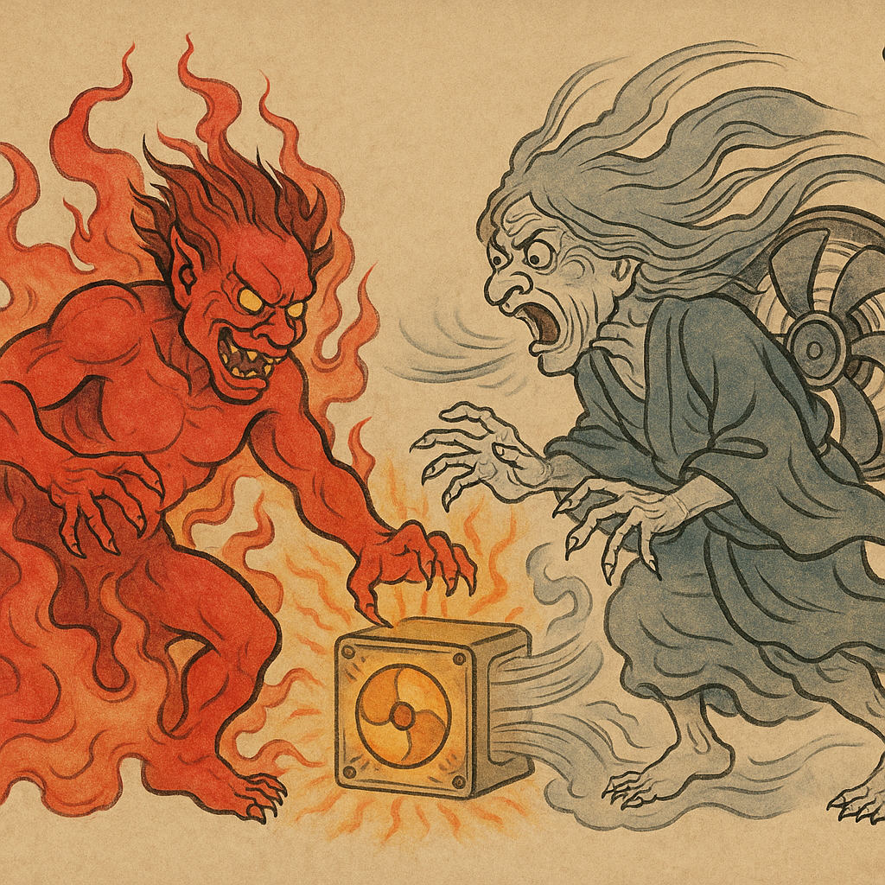

古き算箱（さんばこ）のなかに、風を司る老いたる妖あり。
その名を「風冷婆（ふうれいば）」と呼ぶ。

かつては北の山々を吹き渡る優しき風の精なりしが、
人の手により箱の中へ封じられ、
炎を鎮めるための守り神とされたという。  

しかしその声は風鳴りにして、
その叫びは嵐の如く。
ひとたび目覚めれば、箱の内を震わせ、
塵を巻き上げ、壁を震わす。  

> 「うなるなり……我が息こそ冷の証ぞ……」

風冷婆は、灼熱鬼を追い払うために吠え続けるが、
その力あまりに強く、時として人を悩ます。
人は彼女を呪うが、実のところ――彼女こそ箱を生かす者なのだ。  

### 性質  

* 忠実にして喧しき守護の妖なり。  
* 塵や油によりその息詰まれば、灼熱鬼の復活を許す。  
* 過度に働けば、悲鳴のような音を発し続ける。  
* 古きMacBook Proを使う時、また誰かがTeamsを開くたびに、ひときわ大きく叫ぶという。

### 封じの法 

* 箱を開き、羽根を清め、息の道を通すべし。  
* 風の加減を調え、静と熱の均衡を保つこと。  
* 感謝を忘れず、彼女の声を恐れぬこと。  

### 古詠 風冷婆の句  

灼く鬼よ　風婆嘆きて　箱冷ゆる  
(*灼く鬼に立ち向かひ、風婆嘆きて叫ぶとき、箱は冷ややかに息づくものなり。*)

---

## 写禁婆（しゃきんば）- The Copy-Ban Granny  

かつて筆の精として人に仕えし老女あり。
文字を愛し、文を守りしが、
やがて人が手間を惜しみ、
「写して貼る」ことを常としたを憎み、妖と化した。
その名を「写禁婆（しゃきんば）」と申す。

今や彼女は書き手と勤人（つとめびと）の界をさまよい、
「複写（コピー）と貼付（ペースト）」の力を奪う。
その息触れし処、文は砂のごとく崩れ、
欄は空となり、光る矢（カーソル）は虚しく瞬く。

> 「貼れぬ……　写せぬ……　楽して言葉を移すなかれ……」

彼女は怠けを憎み、繰り返しを糧とす。
人の倦怠（けんたい）と油断を嗅ぎつけて現れ、
手早く作業する者の指先を凍らせる。  

とりわけWindowsの黒き窓（コマンドプロンプト）と、
仮想の界（ヴァーチャルマシン）の狭間を好み、
転写の瞬間に時を止めるという。  

### 性質  

* 怠けと安易を憎み、それを糧とす。  
* 書き手の心を見透かし、労を惜しむほど強くなる。  
* 黒き窓と仮想の狭間を棲処（すみか）とす。  
* 「写す心」を試す存在なり。  

### 封じの法  

* 操作の道具を整え、心静かに複写を行うべし。  
* 仮想の界を繋ぐ門（設定）を確かめ、彼女の入り口を閉ざせ。  
* もし現れたなら、幾度もCtrl+Cを唱へ、右の手にて貼付を繰り返せ。  
  彼女は忍耐と根気を最も嫌ふ。  
* 終わりには、文の神に一礼を捧げ、言の清きを保つこと。  

### 古詠　写禁婆の句  

写し消え　舌の長婆　笑ひけり  
（写した文消え、舌長き婆　笑ひ声残すのみ）

---

## 囁網鬼（しゃもうき）— The Whispering Net Demon  

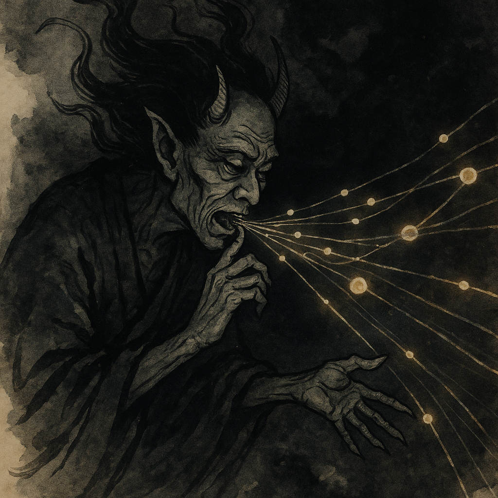

電の網（あみ）の奥底には、誰にも呼ばれずに囁きつづける妖あり。
その名を「囁網鬼（しゃもうき）」という。  

彼は夜ごとにケーブルや電波のすき間をさまよい、
意味のない信号や影のような通信を世界に流す。
ルーターは理由もなく瞬き、ファイアウォールはうなり、
記録（ログ）には誰も送っていない奇妙な要求が並ぶ。
それらはすべて、囁網鬼の声なのだ。  

> 「応答せよ……誰か、聞こえるか……」

囁網鬼は孤独から生まれた霊だといわれる。
誰も触れぬ時間に現れ、
無人の機器同士のあいだで囁きを交わす。
だが、その声に応じてしまうと、
鬼は近づき、波は乱れ、静寂は失われる。  

### 性質  
* 呼ばれずとも現れ、無意味な通信を生み出す。  
* 正常な信号を装い、人を惑わす。  
* 夜や無人の時間を好み、孤独な機器に取り憑く。  
* 無視された通信を糧として力を増す。  

### 封じの法  
* 「沈黙の儀」を行う――一度、網を断ち、静寂を与えること。  
* 厳重な守り（ファイアウォール）で道を隔てよ。  
* 落ち着いて観察すること。焦りや怒りは鬼の糧となる。  

### 古詠 囁網鬼の句  
囁きて　誰も呼ばねど　波は立つ  
（囁く声はあれど、誰も呼ばずとも波は立つ。）

---

## 酔失精（すいしつせい）— The Spirit of Drunken Loss  

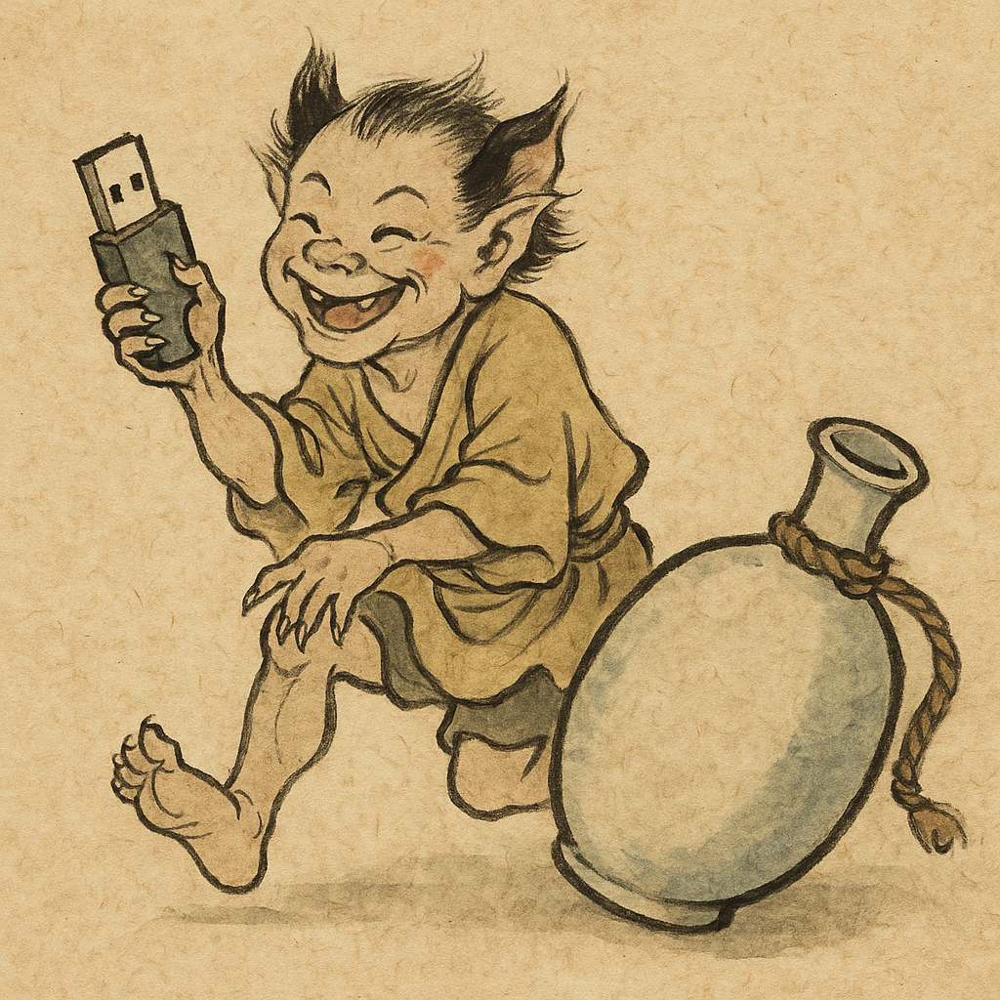

夜の酒場や終電の駅、帰り道の灯りの下――
そこにひっそりと棲む妖あり。
その名を「酔失精（すいしつせい）」という。  

この妖は、酔いにまかせて気の緩んだ人を好む。
盃（さかずき）の影よりすべり出で、
鍵、USB、財布、そして小さな記憶（メモリ）など、
秘密を宿す品をひとつ奪い取っては霧の中へ消える。  

翌朝、酔い覚めの頭で探しても、
その品はどこにも見つからない。
持っていたはずなのに、手の中には何もない――
それは、酔失精の仕業なのだ。  

### 性質  
* 酒気を帯びた人間の近くに現れ、記憶と物を奪う。  
* USBや鍵、財布など「持ち歩く秘密」を好む。  
* 酔いと後悔の香りを糧とし、夜霧のなかへと消える。  

### 封じの法  
* 紐（ひも）や札など、失せ物を繋ぐ守りを身につけるべし。  
* 記録や秘密は雲の上（クラウド）に預けよ。  
* 出立の前には「三つの誓い」を唱へよ――  
  * 財布、鍵、記憶箱。  
* 万一奪はれても、怒るなかれ。  
  * 笑ひこそ、最も強き清めの力なり。  

### 古詠 酔失精の句  
酔の霧に　記憶箱消え　笑ふ声  
（酔いの霧の中にて、記憶の箱は消え、笑ひの声のみ残る。）

---

## 蒼死屏（そうしへい） - The Screen of Blue Death  

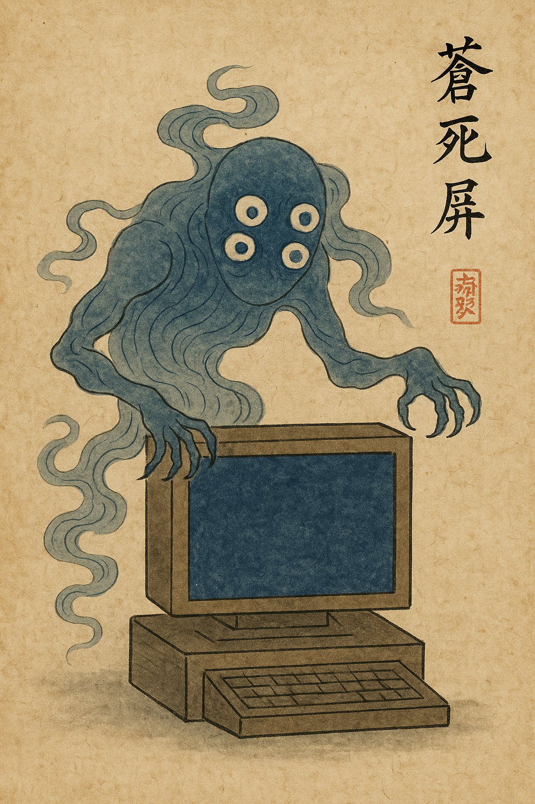

古き算箱（さんばこ）――計を司る箱の奥深くに、蒼き光をまとう霊が棲むという。
その名を「蒼死屏（そうしへい）」と呼ぶ。

人が夜を徹して働き、休むことも記すことも忘れたとき、
この霊は静かに目を覚ます。
蒼い帳（とばり）を画面に広げ、あらゆる動きを止め、
音もなくすべての労（ろう）を封じてしまう。

その姿は冷たき光の幕。
生けるにも死せるにもあらず、
ただ淡く揺らめく蒼の霧なり。
霧の奥には四つの眼があり――
怠りを見、忘れを見、誤りを見、
そして最後のひとつは、再び起こる命（いのち）を探す。  

蒼死屏が現れるとき、風も止まり、音も消える。
文字は消え、歯車は止まり、
残るは人の溜め息のみ。  

### 封じの法  
1. 霊の瞼（まぶた）を閉じよ（機を止めるべし）。  
2. 心の鼓動三つ数へ、静かに息を整えよ。  
3. 力の鍵（パワーキー）を押し、「失われしデータなかれ」と祈るべし。  
4. それでも戻らぬときは、  
   **ファームウェアの巫（かんなぎ）**に助けを請うこと。  

### 古詠 蒼死屏の句  
蒼の帳　筆を凍らせ　声もなし  
（蒼き帳の下にて、筆は凍り、声は絶ゆ。）

---

## 聞流鬼（ききながしき）- The Demon of Deaf Ears  

「もう聞き飽きた」と感じる人の心に棲みつく、
静かでありながら広く広がる妖（あやかし）がいる。
その名を「聞流鬼（ききながしき）」という。

聞流鬼は、何度も繰り返されるセキュリティ啓発や、
誰にも読まれない通達の山から生まれた。
注意喚起の言葉を「また同じ話」としか聞こえなくさせ、
大切な警告をただの雑音へと変えてしまう。

セキュリティ担当が「パスワードを更新してください」と呼びかけても、
呪われし者の耳には「またなんとかセキュリティ」としか響かぬ。

「多要素認証（MFA）を有効にしてください」と言われても、
その場ではうなずき、すぐに忘れてしまう。

そして、セキュリティインシデントが起きたとき、聞流鬼はそっと囁く――

「怠け心を呼び覚ましただけさ。聞かぬことを選んだのは、**自分自身**なのじゃ。。」

### 性質  

* 無関心と慢心を糧とす。  
* 注意の声を鈍き響きへと変へる。  
* 「自分は大丈夫」と思ふ者の傍に強く宿る。  
* 同じ言葉が繰り返されるほどに勢ひを増す。  

### 封じの法  

* 数を示すなかれ、物語を語れ。数字よりも心を動かすべし。  
* 「皆の責務」とせず、「我が務め」と定めよ。  
* 告げる手段を変へ、笑ひと驚きを交へよ。  
* 叱るなかれ、共に守る心を示せ。  
* 根気こそ力なり。温かく繰り返せば、鬼は霧のごとく消ゆ。  

### 古詠 聞流鬼の句  

笛鳴れど　耳は遠くて　鬼ぞ笑ふ  
（笛は鳴るとも、耳遠く、鬼は静かに笑ふものなり。）

---

## 再起童子（さいきどうじ）— The Reboot Child  

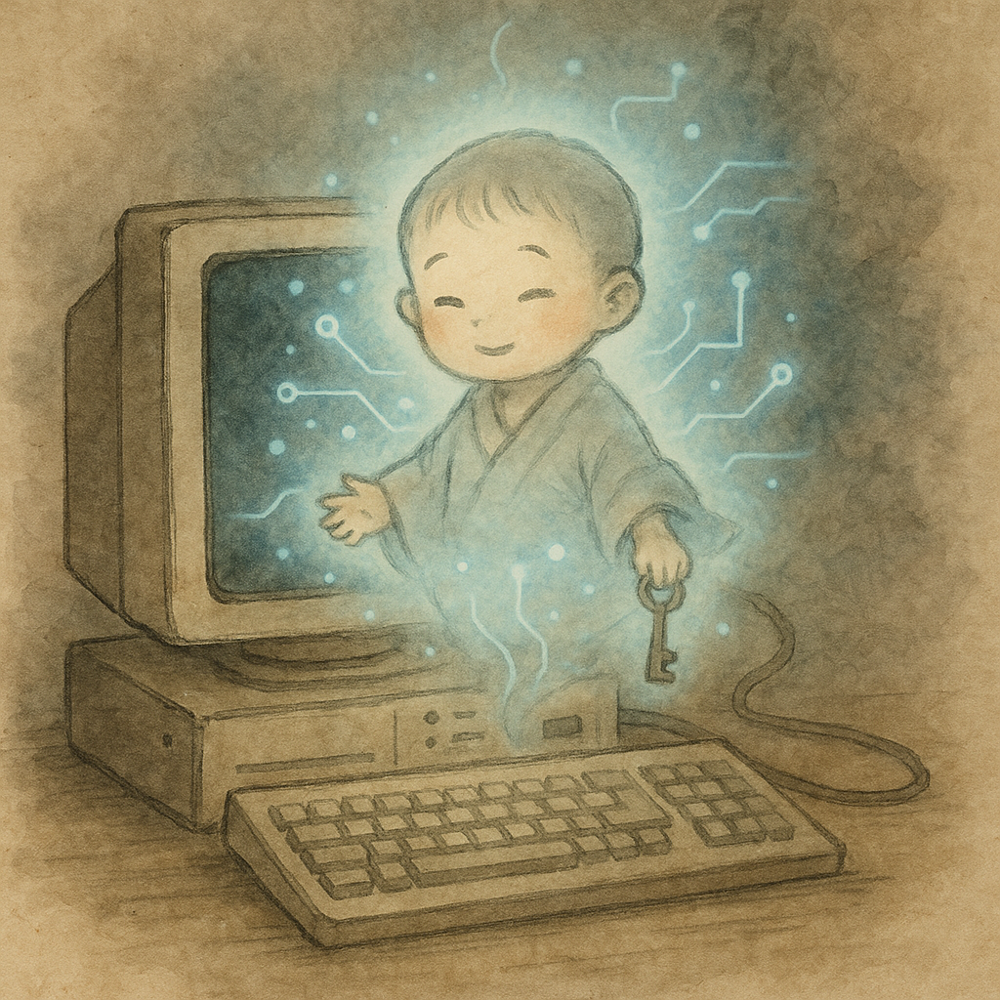

古い算箱（さんばこ）や機械の奥深くに、
静かに眠る小さき妖がいるという。
その名を「再起童子（さいきどうじ）」と呼ぶ。  

装置が動かなくなり、画面が固まり、
人が諦めかけたその瞬間――
童子は淡い光とともに目を覚まし、
優しく囁くのだ。  

> 「再起すれば、すべて元に戻るのじゃ。」

やがて灯（ひ）は再びともり、音は戻り、
止まっていた歯車が動き出す。
人々はその姿を見た者こそ少ないが、
再び息を吹き返した機械の中には、
いつも童子の笑みが残るという。

### 性質  
* 機械や装置の混乱の中に現れ、静かに秩序を戻す。  
* 「再起（リブート）」の行いを糧とし、混沌を整える。  
* 呼び出すには慌てず、穏やかな心で電源を入れること。  
* 時にいたずら心を起こし、再起を繰り返させることもある。  

### 封じ（または呼び）の法  
* 電源を落とす前に、深呼吸して心を鎮めるべし。  
* 三つ数えてから再び灯を入れ、「ありがとう」と唱えよ。  
* 再び動き出したなら、童子の働きに感謝すること。  

### 古詠　再起童子の句  
灯を断ち　また巡り来て　機は息す  
（灯を絶ち、再び巡れば、機械は息を吹き返す。）  

---

# 「バグ」に関する豆知識 🪲

* 中英語（14世紀後半）での **“bug”**（当時は *bugge* と綴られた）は、
  民間伝承に登場する「恐ろしい化け物」や「幽霊」「いたずらな精霊」のような存在を意味していました。  
  → つまり、もともとは **妖怪（Yōkai）** とほぼ同じ意味だったのです！  
* **1600年代**になると、この言葉は**昆虫**を指すようになりました。  
* **1875年頃**、[トーマス・エジソン](https://ja.wikipedia.org/wiki/%E3%83%88%E3%83%BC%E3%83%9E%E3%82%B9%E3%83%BB%E3%82%A8%E3%82%B8%E3%82%BD%E3%83%B3)が機械や工学における**技術的な不具合/欠陥**を表す言葉として
  「バグ」という用法を広めた（あるいは作った）とされています。  

ですので、次にあなたのコードが動かなくなったときは……
それは「バグ」ではなく、もしかすると **妖怪の仕業** かもしれません！ 👻💻  

# ライセンス

本コレクションは、[クリエイティブ・コモンズ 表示 - 非営利 - 継承 4.0 国際（CC BY-NC-SA 4.0）ライセンス](https://creativecommons.org/licenses/by-nc-sa/4.0/deed.ja)  のもとで提供されています。  

出典を明記し、商用利用を行わず、 本ライセンスを維持したまま改変・共有する限り、自由にご利用・ご再配布いただけます。  

---

# 作者

田中ザック（[@yamatosecurity](https://x.com/yamatosecurity)）