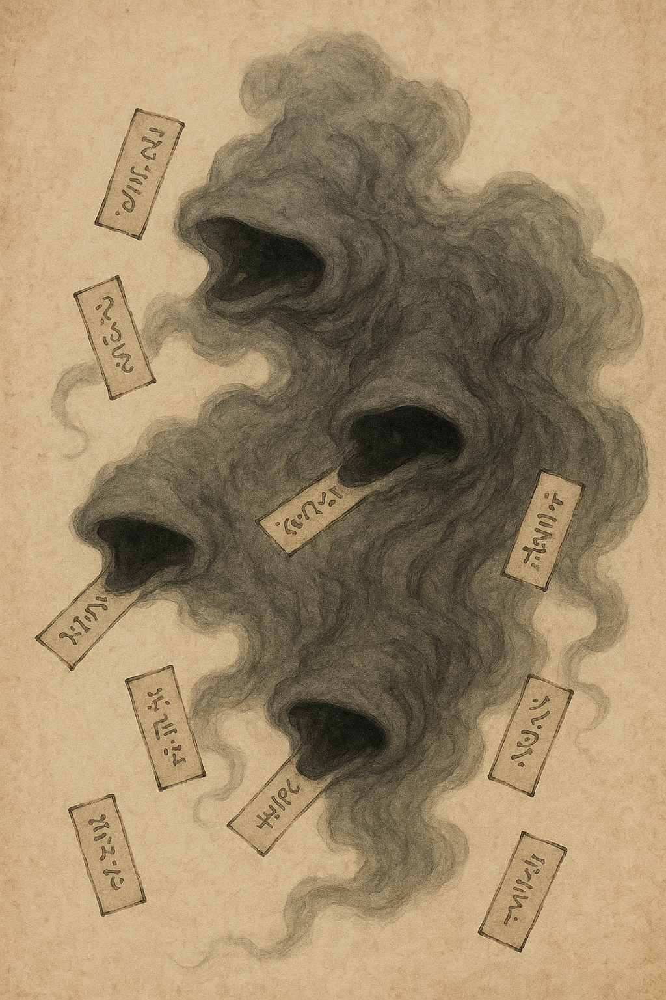
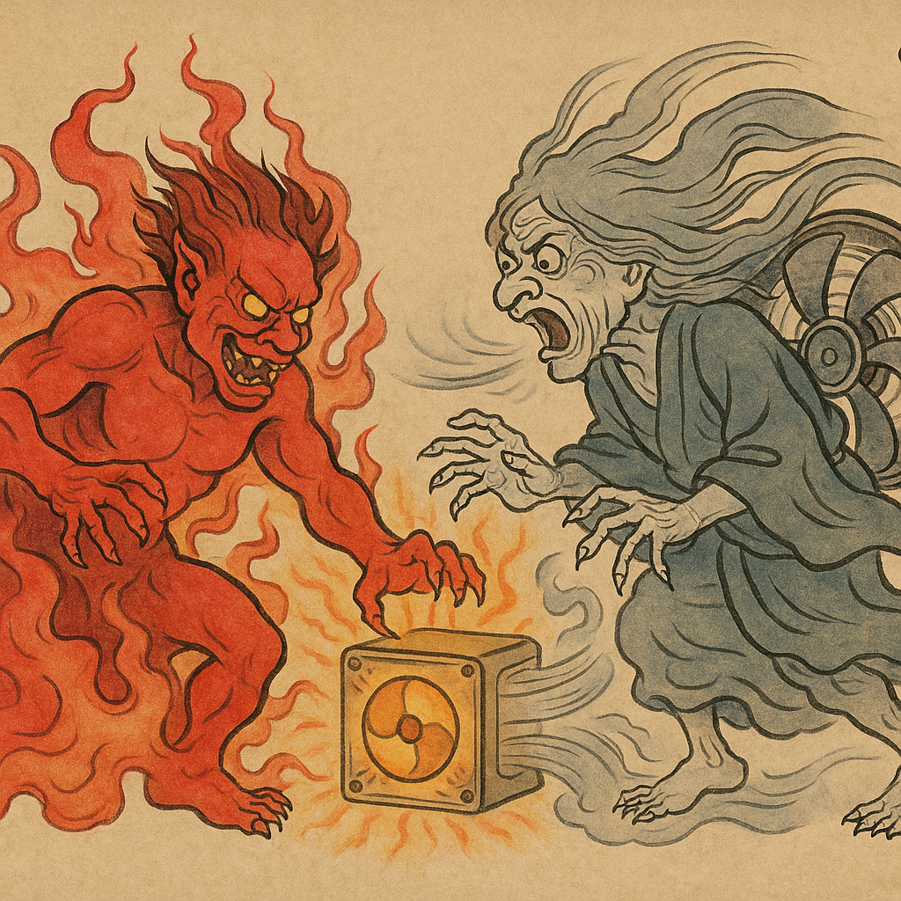
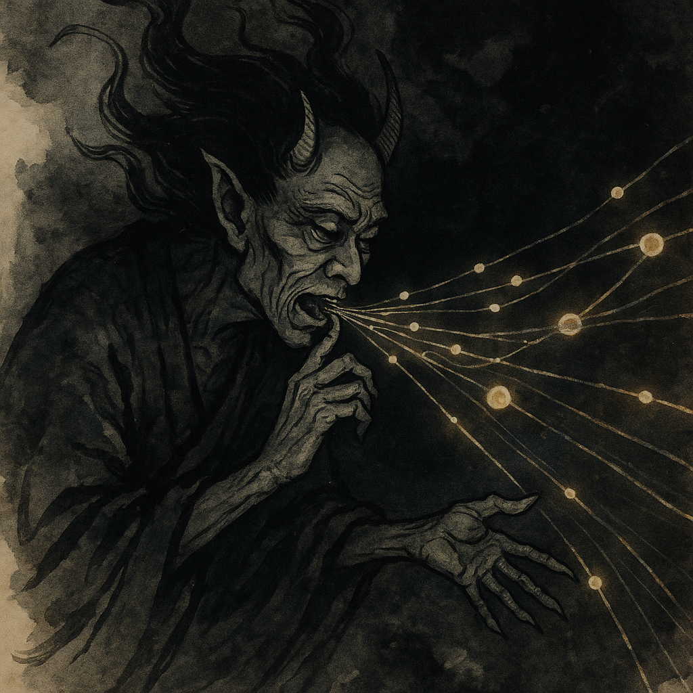

 

    
 

 [ <b>English</b> ] | [<a href="README-Japanese.md">日本語</a>]

# What are Yōkai (妖怪)?

[Yōkai](https://en.wikipedia.org/wiki/Y%C5%8Dkai) (with a long "oh" sound) are traditional Japanese supernatural beings.
There is no perfect translation to English but they can be thought of as a kind of "spooky ghost".
There are thousands of them that have been created for over a thousand years in Japan.
There are many types such as mischivious animals with super powers, monsters that cause harm and invisible ones that explain certain phenomena in the real world.
This repository focuses mainly on this last type.

For example, there is the Makura-gaeshi (枕返し) or pillower-turner that flips your pillow around while you sleep.
Kama-itachi（鎌鼬), the “sickle weasel”, is a weasel with sickles for hands and is said to cut people suddenly with sharp, painless wounds which explains when you get cuts that you do not remember.
Kao-nusubito (顔ぬすびと) the "face theif" lurks in Tokyo commuter trains and eats the expressions off passenger's faces.
If you ever wondered why people on the trains are so expression-less, it is often due to this Yōkai.

# IT Yōkai Collection

After experiencing many strange unexplained phenomena with daily technology and learning about the Yōkai, I started to suspect that some of these phenomena may actually be caused by them.
To confirm my hypothesis, for the past 10 years, I have been researching in the field using Psychokinetic Energy Meters and modified Ectoplasmic Flux Sensors blessed by [Shintō](https://en.wikipedia.org/wiki/Shinto) priests to detect and monitor invisible Yōkai interacting with our modern technology.
Thanks to new advances in technology, by analyzing my field data in my home lab with Quantum-Entangled Yōkai Reconstruction (Q-EYR) and Ectoplasmic Pattern Recognition Model (EPR-2) trained AI, I have finally identified the supernatural Yōkai that have been troubling us humans in the modern era.

I have decided to publicize my findings so that others may finally find out the causes for their certain unexplained events in IT and take countermeasures against them.

---

## Nagui (名食い) — The Name Eater

In old tales, there was said to be a spirit that devoured names, severing the bond between word and thing.
When Nagui drifts through the unseen paths of information, names vanish from memory, servers cannot be called, and addresses lead only into mist.

It appears as a drifting fog with countless whispering mouths.
You might hear faint murmurs through the cables:

“Cannot find name… No name exists…”

Nagui especially haunts those who try to summon distant hosts or forgotten domains. It consumes domain records, hides addresses, and leaves the traveler lost in the void of “unresolved queries.”

### To exorcise the Nagui:
* Perform the eightfold chant of Re-solve.
* Purify the route with clear water (flush the DNS cache).
* Write the true names into the sacred hosts ledger.

### Ancient Nagui Haiku:

名の道を　喰らひて笑ふ　霧の声 
(The path of names - it devours and laughes - sounds from the mist)

---

## Ronsenki (論煽鬼) - The Debate-Stirring Demon

Ronsenki, the Debate-Stirring Demon, dwells in every network where words can be traded.
It whispers into your mind the moment you see something your disagree with online:

**“They’re wrong. Correct them. Now!”**

Once you reply, the demon multiplies.
Each counterargument summons another.
Logic frays, tempers flare, and no one emerges wiser.
When the thread finally dies, only Ronsenki remains — smiling in the embers of wasted time.

### Nature:
* Feeds on the human need to be right.
* Possesses both sides equally.
* Its presence is strongest in SNS sites, forums and comment sections.
* Can imitate the feeling of moral clarity, but only to ignite quarrels.

### Exorcism:
* When the urge to reply arises, breathe deeply and count to three.
* Whisper to yourself, “It is not my duty to fix the world.”
* Close the window, drink some tea, and take walk outside.
* Remember: every demon grows weaker when starved of attention.

### Ancient Ronseki Haiku

言の海　正す指あり　鬼ぞ笑ふ
(In a sea of words - pointing fingers — the demon laughs.)

---

## Kōshinma (更新魔) — The Update Demon

**Kōshinma, The Update Demon**, is a courteous yet cruel Yōkai that strikes at the worst possible time.  
Just when the user is busiest — before a presentation, meeting, etc... — it appears with a polite message:  
> “Updates are ready. Please restart now.”

Once awakened, Kōshinma cannot be reasoned with.  
The progress bar crawls endlessly at 99%, and productivity falls into silence.

### Nature
* Manifests during critical or stressful moments.  
* Feeds on frustration caused by forced restarts and long updates.  
* Speaks politely, masking its malice with system notifications.
* Delights in loops, freezes, and “Please do not turn off your computer.”
* Kōshinma typically wreaks havoc on Windows machines.

### Exorcism
* Perform regular updates on your own schedule — calm offerings keep it asleep.  
* Pause updates before critical meetings or tasks.  
* Set reboot deferrals and maintain backups of all important work.  
* Never rage; frustration strengthens it.

### Ancient Kōshinma Haiku
急ぐ夜　青き輪まわる　声は笑ふ (Rushing night — the blue ring spins — the voice laughs softly.)

---

## Bōkenki (忘鍵鬼) - The Forgotten Key Demon

Bōkenki, the Forgotten Key Demon, is a sly spirit that feeds on the memory of their incantations to pass through systems.
It drifts unseen through offices and bedrooms alike, waiting for the moment a mortal needs to remember their password — and then quietly consumes that thought.

His stash rattles with countless keys that no longer fit any lock.
It delights in panic — that cold flash when your mind blanks and the “incorrect password” message repeats endlessly.

### Nature
* Devours the memory of passwords.
* Grows stronger the longer you neglect your password usage.

Its laughter is heard faintly in the distance as he watches you in joy as you get more worried about not being able to log in.

### Exorcism
* Keep a single Master Key that you use for your password safe.
* Protect your scrolls of passwords with encryption charms.
* Renew old keys monthly to weaken its hold.
* When all else fails, invoke the Rite of Reset — sacrifice the old and begin anew.

### Ancient Bōkenki Haiku

鍵忘れ　思ひ出すまじ　鬼の舌
(The key forgotten — never to return — the demon’s tongue licks clean.)

---

## Enpyōki (焔評鬼) - The Reputation Scorching Demon

Enpyōki, the Reputation Scorching Demon, lies dormant within old words — tweets, posts, notes, or idle jokes from long ago.
When the air turns dry with anger, and many eyes fall upon forgotten phrases, Enpyōki awakens.

It feeds particularly on misunderstanding, misinformation and unjustified outrage, rising like wildfire from ashes of intent.
Its laughter is the sound of notifications piling endlessly.
Its favorite victims are those who meant no harm, for innocence burns brightest.

## Nature
* Lives within archives, old posts, cached memories.
* Feeds on audience attention and emotional heat.
* Once awakened, it draws more spirits (retweets, replies) to fan its flames.

## Exorcism
* Accept what was written — acknowledgement calms its hunger.
* Never add wind to fire — silence starves it.
* Speak again only after the embers cool.
* Whisper the cooling charm: “I meant well — let the flame cool.”

### Ancient Enpyōki Haiku

言の灰　大焔となり　人ぞ寄る
(From the ash of words - a great flame — people draw near.)

---

## Kiokushokki (記憶蝕鬼) — The Memory-Eroding Fiend

In the hidden chambers of computing boxes there dwells a small, bitter Yōkai that gnaws at memory itself.
Called Kiokushokki, it manifests where bounds are loose and checks are forgotten.
It appears as a little imp woven of frayed bits and corrupted bytes; where it passes, clean memory becomes scrambled and orderly data mutates into dangerous nonsense.

### Nature
* It seeks out-of-bounds places: stray writes, under-checked arrays, and unchecked lengths.
* It thrives on unvalidated input, unchecked arithmetic, and neglected invariants.
* Its presence is marked by strange crashes, corrupted files, nondeterministic behavior, or values that suddenly change.

### Exorcism
* Enforce bounds: always check sizes and ranges; never assume inputs are honest.
* Use memory guards: stack canaries, safe allocators, hardened runtimes.
* Enable mitigations: ASLR, DEP/NX, Control-Flow Integrity (CFI), and compiler hardening options.
* Prefer memory-safe constructs: adopt safer languages or strong abstractions (where appropriate) to reduce whole classes of errors.
* Fuzz and sanitize: fuzz inputs, run sanitizers (ASan/UBSan) and static analysis to reveal latent corruption.
* Patch and monitor: keep systems updated, collect logs, and use runtime detection to catch anomalies early.
* Defensive coding rituals: code review, unit tests, and explicit contracts/invariants are daily offerings that keep Kiokushokki weak.

Note: where haste and habit prevail, Kiokushokki feasts best. Diligence, measurement, and ritual testing are its ancient enemies.

### Ancient Kiokushokki Haiku:

記憶の層　爪に裂かれて　無音崩壊
(Layers of memory — torn by claws - a soundless collapse.)

---

## Kejimō (化字魍) — The Distortion Spirit of Broken Text

Kejimō, the Distortion Spirit, is a Yōkai that dwells in the boundary between languages and encodings.
It feeds on the souls of written symbols, twisting them into meaningless glyphs deriving joy from the torment of those trying to undo his mischief.
Where once a sentence stood, now only the ghosts of letters remain — garbled, unpronounceable, and cursed.

When old scripts meet new ones, or when messages pass between worlds (like between East and West, or one software to another), Kejimō slips in.
It rearranges meaning, turns poetry to gibberish, and mocks mortals with lines of `□□□□□` and `縺ゅ＞縺�∴縺�`.

### Nature
* Appears when languages collide or fonts disagree.
* Grows strong in emails, text files, or data sent without care.
* Whispers in glitchy fonts, laughing at those who seek perfection in code.
* He particularly enjoys tormenting non-English locale Windows users.

### Exorcism
* Use pure encoding — the sacred standard known to scholars as Unicode.
* Keep foreign symbols in their proper form; respect the difference of tongues.
* If a file becomes cursed, perform the Rite of Re-Encoding.
* Chant the holy phrase: “Seal it in UTF-8, that the spirits may rest.”

### Ancient Kejimō Haiku

文の魂　喰ひて笑ふは　化字魍 (The soul of words — it devours and laughs — the Kejimō)

---

## Shaku-netsu-ki (灼熱鬼) — The Demon of Scorching Heat

In the belly of the Sanbako (算箱) - calculating chest - dwells a demon of burning heart.
Born from dust, neglect, and the unending toil of machines, Shakunetsuki feeds upon computation itself, kindling every spark into fever.

Its skin glows red like molten iron, and its breath burns the circuits it inhabits. The faint scent of scorched metal is said to mark its passage.
It delights in burdening the machine’s heart — driving the cores to frenzy until even silence trembles.

## Nature
* Awakens when too many tasks are offered without rest.
* Feasts on forgotten vents and dusty fans.
* Spreads its warmth like a curse until all performance falters.
* Is particularly strong on Intel-based CPUs, especially in the older Macbook Pros.

## Exorcism
* Dust must be cleansed, offerings of cool air presented, and the sacred shutdown incantation performed at dawn.

### Ancient Shakunetsuki Haiku

焦がす息　鉄の箱より　壊れゆく
(Scorching breath — from the iron box it comes - all begins to break.)

---

## Fūreibā (風冷婆) — The Screaming Fan Granny

To combat the infernal Shakunetsuki, the spirits of air conjured a guardian — Fūreibā, the Screaming Fan Granny.
Once a gentle breeze spirit of the northern mountains, she was bound within the Sanbako by mortal engineers.
Her duty: to howl, to scream, to drive back the flames of Shakunetsuki.

When roused, she spins with such fury that dust scatters like sand storm.
Yet though her power preserves life, her voice is unbearable - a droning gale that shakes both ear and mind.
Thus mortals curse her even as she saves them.

### Nature
* Loyal but loud; when she rises, all else must endure her wailing.
* When neglected, she grows sluggish, allowing Shakunetsuki to return.
* When overburdened, she shrieks endlessly in protest.
* Fūreibā screams particularly loud on old Macbook Pros and whenever anyone opens Teams.

### Balance of the two:
* The two Yōkai exist in eternal struggle — the flame and the wind, locked in a cycle of noise and heat.
* Too much wind, and peace is lost; too little, and the fire consumes.
* In this balance lies the harmony of all machines.

### Ancient Shaku-netsu-ki and Fūreibā Haiku

灼く鬼よ　風婆嘆きて　箱冷ゆる
(The burning demon roars — the wind granny wails — the box cools)

---

## Shakinba (写禁婆) — The Copy-Ban Granny

Shakinba, the Copy-Ban Granny, is an ancient spirit of frustration and futility.
She haunts scribes and office workers alike, stealing the great power of Copy and Paste.
Where her breath lingers, the clipboard turns to dust — text disappears, shortcuts fail, and the cursor blinks mockingly in an empty field.

Once, she was a temple scribe who grew jealous of the ease of modern copying.
When she died, her soul clung to the “machines of writing,” determined that no one should move words so easily again.

### Nature
* Feeds on repetition and laziness — the more one copies, the stronger she grows.
* Whispers “貼れぬ…写せぬ…” (“Cannot paste… cannot copy…”) when near.
* Takes residence often in the Windows Command Prompt and between Virtual Machines, freezing them at the moment of transfer.

### Exorcism
* Check your VM settings to prevent her from getting in your way.
* Many times, she is powerful and you need to persevere with your Ctrl+C copies and right-click pastes until she is defeated.

### Ancient Shakinba Haiku

写し消え　舌の長婆　笑ひけり
(The copied text fades — the long-tongued hag - nothing but laughter.)

---

## Shamōki (囁網鬼) - The Whispering Net Demon

**Alias:** Ghost in the wire

Shamōki, the Whispering Net Demon is the creator of all of your mysterious network traffic.
He crawls through cables and wireless channels like a restless spirit, desperate to be heard.

No one summons him, yet he speaks constantly — sending meaningless pings, phantom packets, and ghostly handshakes into the dark.
Routers blink for no reason, firewalls murmur, and administrators stare at logs filled with nonsense requests.

These are not random — they are his voice.

Each echo, each unexplained packet, is a whisper of his loneliness — and every attempt to trace him only draws him nearer.

### Nature
* Generates unexplained network chatter and random connections.
* Masquerades as system processes or legitimate hosts.
* Often appears in idle hours, or when no user is present.
* Grows stronger when ignored traffic is dismissed as “just background noise.”

### Exorcism
* Perform the Rite of Silence (disconnect the network briefly).
* Erect digital wards (strict firewall rules, segmented networks).
* Observe with calm — emotional responses feed him.

### Ancient Shamōki Haiku

囁きて　誰も呼ばねど　波は立つ
(He whispers still — though no one calls - the waves arise.)

---

## Sui-shitsu-sei (酔失精) — The Spirit of Drunken Loss

Suishitsusei, the “Spirit of Drunken Loss,” is a mischievous sprite said to haunt taverns, train stations, and late-night streets.
It slips silently from the shadow of a sake gourd, seeking the metallic scent of USB drives, keys, or small trinkets that contain secrets.
When it finds one, it snatches it away and vanishes into the night fog — leaving only regret and a hangover.

Those who wake the next morning find their pocket lightened and their memory dimmed.
They swear they had the item — yet it has been spirited away.

### Exorcism
* Attach a charm of tethering (lanyard or strap).
* Place copies of your memory box in the cloud, beyond mortal reach.
* Recite the Three Holy Checks: wallet, keys, drive before leaving any tavern.
* Seal thy data in cipher, lest the spirits read thy secrets.
* Should the loss occur, smile and accept it — laughter is the surest purification.

### Ancient Suishitusei Haiku

酔の霧に　記憶箱消え　笑ふ声
(In the mist of drink - the memory box fades to nothing — laughter lingers)

---

## Sōshihei (蒼死屏) — The Screen of Blue Death

In ancient accounts it is said: within the Sanbako (算箱) — a device for reckoning numbers swifter than any abacus — there slumbers a pale spirit.
When the toiler grows heedless, working deep into the night without offering rest or record, the spirit awakens.

It spreads a veil of blue light upon the face of the device, halting all movement, silencing all work.
Thus the wise proclaim, “Where the blue glow reigns, all labors perish.”

It is shaped of cold luminescence, neither living nor dead, appearing as a wavering pane of azure mist.
Four eyes gleam within: one beholds sloth, one forgetfulness, one error, and one — the eye of renewal — seeks the lost key that reawakens the dead machine.

At its coming, even the wind holds its breath.
Letters vanish, wheels cease to turn, and the sound of human sighs becomes the only echo.

### Exorcism
1. Close the spirit’s eyelid (shut down the machine).
2. Count to three beats of the heart.
3. Press the sacred Key of Power while whispering the prayer of "No data loss".
4. Should all else fail, consult a shrine-keeper learned in Firmware to exorcise lingering corruption.

### Ancient Sōshihei Haiku

蒼の帳　筆を凍らせ　声もなし
(Beneath the blue shroud - the brush freezes — no voice remains.)

---

## Kikinagashiki (聞流鬼) — The Demon of Deaf Ears

**Kikinagashiki, The Demon of Deaf Ears**, is a subtle yet pervasive Yōkai that dwelleth in the minds of those who have “heard it all before.”  
Born from endless awareness campaigns and unread memos, it transforms security guidance into background noise.  

When the security team proclaimeth, *“Update your passwords!”*, the cursed hear only *“blah, blah, policy.”*  

When told *“Enable MFA,”* they nod sagely, then forget.

And when calamity striketh, Kikinagashiki whispereth:  
> “I merely brought out their lazy nature — **they** chose not to listen.”

### Nature
* Feeds upon indifference, overconfidence, and alert fatigue.  
* Muffles words of caution, turning them into dull hums.  
* Spreads easily among teams who say, “It won’t happen to us.”  
* Strongest when advice is repetitive, abstract, or delivered without empathy.  

### Countermeasures
* **Tell stories, not statistics** — human tales pierce its veil.  
* **Assign names and duties** — “everyone’s job” is no one’s job.  
* **Vary the ritual** — posters, humor, surprises; monotony strengthens it.  
* **Speak as ally, not overseer** — partnership weakens its hold.  
* **Persist** — repetition with warmth dispelleth its fog.  

### Ancient Kikinagashiki Haiku
笛鳴れど　耳は遠くて　鬼ぞ笑ふ  (Though the flute soundeth — the ears turn away - the demon laughes.)

---

## Saiki Dōji（再起童子） — The Reboot Child

In the world of machines, there exists a small, kind Yōkai known as **Saiki Dōji** — the spirit of reboot and renewal.  
When devices falter, freeze, or lose their way, this little being awakens at the moment the user presses the sacred button of restart.  
With a single sigh of light, it closes all processes, clears the path, and breathes life back into what was once lost.  

It is said that Saiki Dōji wanders through the sleeping circuits of computers, touching each one gently.  
Where it passes, old code is refreshed, dust is forgotten, and even weary processors grow **young and energetic again — as lively as the child spirit itself.**  

To those who despair before the darkened screen, it grants one simple revelation:  

> “Reboot, and all shall be well.”  

### Nature
* Appears when machines become sluggish or strange errors occur.  
* Feeds on the act of restart — order reborn from chaos.  
* Revives computers, making them young, light, and lively once more.  
* Leaves no trace but renewed function and a faint sense of peace.  

### Rite of Invocation
* Press the sacred button of power with calm intent.  
* Whisper softly: “Restart, little one, bring harmony anew.”  
* Await the second dawn — when the screen lights once more, give thanks.  

### Ancient Saiki Dōji Haiku  

落ちし声　息を吹き返し　再び灯る  (The fallen voice — breath returns — and light rekindles once more.)

---

# License

This collection is provided under the [Creative Common's Attribution-NonCommercial-ShareAlike 4.0 International](https://creativecommons.org/licenses/by-nc-sa/4.0/deed.en) license.
Feel free to use, share and adapt as long as you give proper attribution, do not use it commercially and keep this same license if you do build upon this material.

# Author

Zach Mathis (@yamatosecurity)